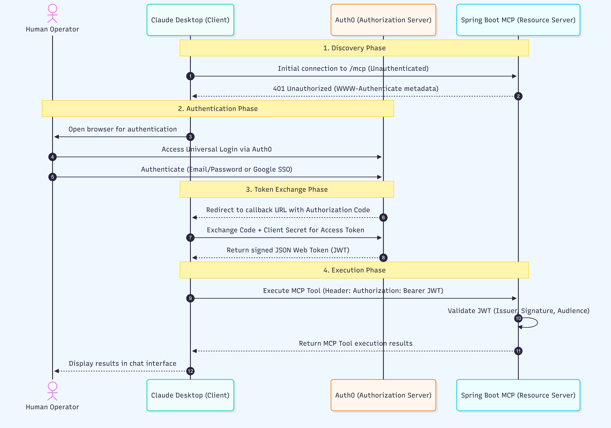

# Project Authorization Details

## 1. Architecture Overview
This document outlines the security architecture for the Spring Boot Model Context Protocol (MCP) server. The system operates as an OAuth 2.0 Resource Server deployed on Render, utilizing Auth0 as the Authorization Server and Claude Desktop as the primary client.

*   **Client (Claude Desktop):** Initiates the MCP connection using the OAuth 2.0 Authorization Code flow with PKCE (for human authentication) and the Client Credentials grant (for background token exchange).
*   **Resource Server (Spring Boot / Render):** The backend hosting the MCP tools. It validates incoming JWT access tokens before permitting tool discovery and execution.
*   **Authorization Server (Auth0):** Manages user identities, validates client credentials, and mints JWTs scoped to the specific Render API.

## 2. Authorization Flow
1.  **Discovery:** When Claude Desktop attempts an initial unauthenticated connection, the Spring Boot server rejects it with a `401 Unauthorized` and a `WWW-Authenticate` header pointing to `/.well-known/oauth-protected-resource/mcp`.
2.  **Redirection:** Claude parses the metadata to locate the Auth0 issuer and redirects the user to the Auth0 Universal Login page.
3.  **Authentication:** The human operator authenticates via email/password or Google SSO to authorize the session.
4.  **Token Exchange:** Auth0 redirects back to Claude's strict callback URL (`https://claude.ai/api/mcp/auth_callback`). Claude exchanges the provided authorization code for a signed JWT.
5.  **Execution:** Claude attaches the JWT as a Bearer token in the `Authorization` header for all subsequent MCP JSON-RPC requests to the Spring Boot server.

## 3. Auth0 Configuration Components
The Auth0 tenant is configured with specific logical components to support the MCP ecosystem:

*   **Client Application (Regular Web Application):** Represents Claude Desktop. It securely holds the Client ID and Client Secret. The Token Endpoint Authentication Method is set to **Post**, and both **Authorization Code** and **Client Credentials** grant types are enabled.
*   **Custom API:** Represents the Spring Boot MCP server. It is registered with an API Identifier that exactly matches the Render deployment URL (`https://vksonpdl-first-mcp.onrender.com/mcp`).
*   **Allowed Callbacks & Origins:** Explicitly whitelists `https://claude.ai/api/mcp/auth_callback` and `https://claude.ai` to ensure secure token delivery to the Claude ecosystem.

## 4. Spring Boot Resource Server Security
The Spring Boot application enforces security at the HTTP transport layer using the `mcp-server-security` library (version `0.1.14`) alongside standard Spring Security.

*   **Issuer Alignment:** The `McpServerOAuth2Configurer` requires the exact Auth0 issuer URI (including the trailing slash) to satisfy Spring Security's OpenID Connect validation.
*   **Audience Validation:** The built-in MCP strict audience check is disabled (`mcpAuthorization.validateAudienceClaim(false)`). Token validation is delegated to a custom `JwtDecoder` using an `OAuth2TokenValidator` to verify that the incoming JWT's `aud` claim matches the Render API identifier.
*   **Endpoint Routing:**
    *   `/health` is unconditionally permitted to support Render health checks and prevent cold-start timeouts.
    *   `/mcp` requires a valid, authenticated JWT.
    *   Standard REST API endpoints (e.g., `/api/**`) can be secured separately from the MCP tools using specific scope matchers (e.g., `.hasAuthority("SCOPE_api:access")`) or `@PreAuthorize` method annotations to prevent the LLM from accessing traditional application APIs.

## 5. Tool-Level Authorization Status
Authorization is currently implemented as a binary gate at the HTTP transport level. Once a user authenticates with Auth0 and provides a valid JWT, they have full access to discover and execute all MCP tools exposed by the Spring Boot server. Role-Based Access Control (RBAC) and tool-specific scope restrictions are not yet enabled.

## 6. Alternative: API Key Authentication [ NOT USED ]
For scenarios requiring headless integration without interactive OAuth logins, the server supports API Key authentication via `McpServerApiKeyConfigurer`. This swaps the JWT validation out in favor of extracting a static token (e.g., `X-API-KEY`) from the HTTP header and validating it against an `ApiKeyEntityRepository`.

## 7.MCP Authorization Sequence Flow

The authorization process leverages the standard OAuth 2.0 Authorization Code flow to securely delegate access to the Spring Boot server.

1. **Discovery Phase:** Claude Desktop makes an initial, unauthenticated request to the Spring Boot server's `/mcp` endpoint. The server denies access, returning a `401 Unauthorized` status along with a `WWW-Authenticate` header. This directs Claude to the resource server's OAuth metadata.
2. **Authentication Phase:** Claude reads the metadata to identify Auth0 as the Authorization Server and opens a browser, redirecting the user to the Auth0 Universal Login page. The human operator authenticates their identity (via email/password or Google SSO).
3. **Token Exchange Phase:** After successful authentication, Auth0 redirects the user back to Claude Desktop's callback URL, providing a temporary Authorization Code. Claude securely exchanges this code (along with its Client ID and Client Secret) at Auth0's token endpoint to retrieve a signed JSON Web Token (JWT).
4. **Execution Phase:** Armed with the JWT, Claude Desktop resumes communication with the Spring Boot server, passing the token in the HTTP `Authorization` header as a `Bearer` token. The server validates the token's digital signature, issuer, and audience before allowing Claude to discover and execute any MCP tools.

